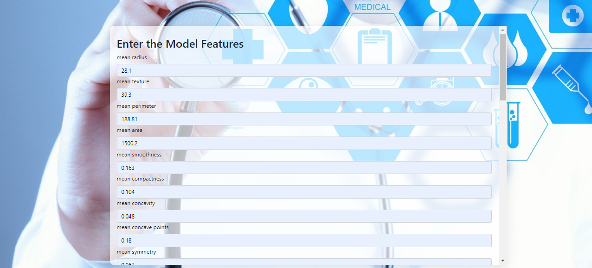
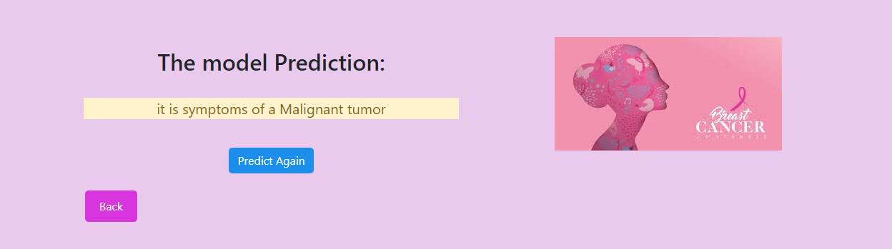
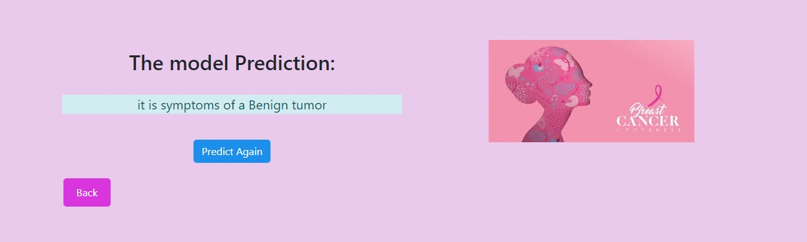

# MLOps_Docker_Swarm_Breast_Cancer


# Breast Cancer Prediction Smart Web Service with Docker_Swarm

## Overview

The Breast Cancer Prediction Web Service is a Flask-based application designed to assist in the early detection of breast cancer using a machine learning model. This application aims to provide accurate predictions based on user-input data, facilitating timely medical interventions.

## Project Structure
```bash
.
├── README.md
├── app
│   ├── models
│   │   ├── breast_cancer.py
│   │   └── model.pkl
│   ├── routes.py
│   ├── static
│   │   ├── assets
│   └── templates
│   ├── __init__.py
│   ├── db_models.py
│   ├── ml_models.py
├── app.py
├── config.py
├── docker_compose.yml
├── Dockerfile
├── instance
│   └── users.db
├── members.txt
├── requirements.txt
├── run.sh
└── setup.sh
```

###
 
 


### Installation and Run

1. **Clone the Repository**:
   ```bash
   git clone https://github.com/ZahraSahraei/MLOPs_Docker_Swarm_Breast_Cancer.git
   ```

2. **Setup**: Execute the provided bash script (`setup.sh`) to set up your environment 
   ```bash 
   chmod +x setup.sh
   ./setup.sh 
   ```
3. **Run the app**: Once the setup is complete, you can run the application 
   ```bash 
   python3 app.py
   ```


The application will be available at host: http://188.121.98.206:5000/ .


## 
### App snapshots

<div style="text-align: center;"></div>
 
 

